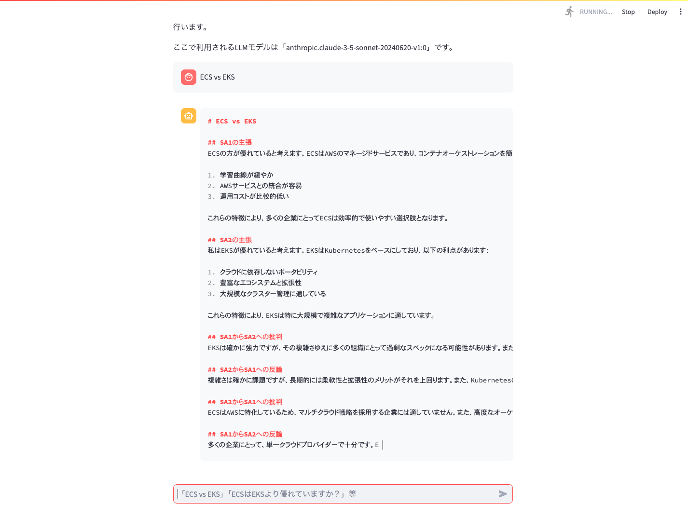

# awssample-gen-ai-agent
ECS vs EKSのようなテーマで、生成AIエージェントが比較議論を行うツール。



## QuickStart
- Checkout the code
    ```
    git clone https://github.com/t-tkm/awssample-gen-ai-agent.git
    cd awssample-gen-ai-agent
    ```

- Work performed only once at the beginning of project creation
    ```
    python -m venv .venv
    source .venv/bin/activate
    pip install -r requirements.txt
    ```

- Performed each time the application is launched
    ```
    export AWS_ACCESS_KEY_ID=<aws access key>
    export AWS_SECRET_ACCESS_KEY=<aws secret key>
    export AWS_SESSION_TOKEN=<aws security token>
    export AWS_DEFAULT_REGION=us-east-1
    ```

- Run the Agent
    ```
    streamlit run aws_agent.py
    # View at localhost:8501
    ```
# その他
sampleディレクトリに実行結果のサンプルを格納しています。同じ「ECS vs EKS」のような議論テーマでも、問合せタイミングによって結論が異なる場合があります(sample1/Sample2)。