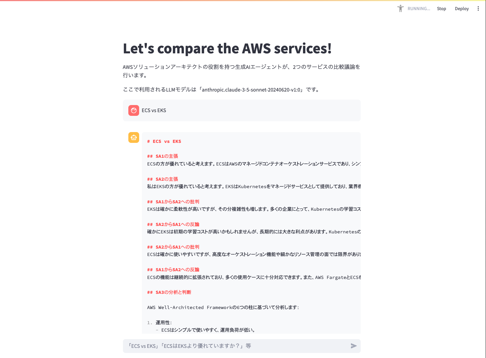

# awssample-gen-ai-agent
## 概要
ECS vs EKSのようなテーマで、生成AIエージェントが比較議論を行うツールです。



## 指示プロンプト
```
# 指示
- SA1、SA2、SA3は優れたAWSソリューションアーキテクトです。
- 1人目のSA1は、テーマを肯定する主張をして、その理由を説明してください。
- 2人目のSA2は、テーマを肯定する主張をして、その理由を説明してください。
- その後、SA1は、SA2の主張に対する批判を述べ、SA2はそれに反論してください。
- 次に、SA2は、SA1の主張に対する批判を述べ、SA1はそれに反論してください。
- 最後に、3人目のSA3は、2人の意見をまとめ、論理的に分析して、最終的にどちらの主張に賛成するか判定してください。
- SA3は、AWS Well-Architected Frameworkの6本の柱の観点、運用性、セキュリティ、信頼性、パフォーマンス効率、コスト最適化、持続可能性から論理的な分析を行なって下さい。
# 出力
- 上記を、日本語で、Markdown記法に変換してください。
```

## QuickStart
- Checkout the code
    ```
    git clone https://github.com/t-tkm/awssample-gen-ai-agent.git
    cd awssample-gen-ai-agent
    ```

- Work performed only once at the beginning of project creation
    ```
    python -m venv .venv
    source .venv/bin/activate
    pip install -r requirements.txt
    ```

- Performed each time the application is launched
    ```
    export AWS_ACCESS_KEY_ID=<aws access key>
    export AWS_SECRET_ACCESS_KEY=<aws secret key>
    export AWS_SESSION_TOKEN=<aws security token>
    export AWS_DEFAULT_REGION=us-east-1
    ```

- Run the Agent
    ```
    streamlit run aws_agent.py
    # View at localhost:8501
    ```
## その他
sampleディレクトリに実行結果のサンプルを格納しています。同じ「ECS vs EKS」のような議論テーマでも、問合せタイミングによって結論が異なる場合があります(sample1/Sample2)。

## LLMモデル
「anthropic.claude-3-5-sonnet-20240620-v1:0    |  Claude 3.5 Sonnet               |  Anthropic」を使用。

(参考)
```
aws bedrock list-foundation-models --output table --query 'modelSummaries[*].[modelId,modelName,providerName]'

----------------------------------------------------------------------------------------------------
|                                       ListFoundationModels                                       |
+-----------------------------------------------+----------------------------------+---------------+
|  amazon.titan-tg1-large                       |  Titan Text Large                |  Amazon       |
|  amazon.titan-image-generator-v1:0            |  Titan Image Generator G1        |  Amazon       |
|  amazon.titan-image-generator-v1              |  Titan Image Generator G1        |  Amazon       |
|  amazon.titan-text-premier-v1:0               |  Titan Text G1 - Premier         |  Amazon       |
|  amazon.titan-embed-g1-text-02                |  Titan Text Embeddings v2        |  Amazon       |
|  amazon.titan-text-lite-v1:0:4k               |  Titan Text G1 - Lite            |  Amazon       |
|  amazon.titan-text-lite-v1                    |  Titan Text G1 - Lite            |  Amazon       |
|  amazon.titan-text-express-v1:0:8k            |  Titan Text G1 - Express         |  Amazon       |
|  amazon.titan-text-express-v1                 |  Titan Text G1 - Express         |  Amazon       |
|  amazon.titan-embed-text-v1:2:8k              |  Titan Embeddings G1 - Text      |  Amazon       |
|  amazon.titan-embed-text-v1                   |  Titan Embeddings G1 - Text      |  Amazon       |
|  amazon.titan-embed-text-v2:0:8k              |  Titan Text Embeddings V2        |  Amazon       |
|  amazon.titan-embed-text-v2:0                 |  Titan Text Embeddings V2        |  Amazon       |
|  amazon.titan-embed-image-v1:0                |  Titan Multimodal Embeddings G1  |  Amazon       |
|  amazon.titan-embed-image-v1                  |  Titan Multimodal Embeddings G1  |  Amazon       |
|  stability.stable-diffusion-xl-v1:0           |  SDXL 1.0                        |  Stability AI |
|  stability.stable-diffusion-xl-v1             |  SDXL 1.0                        |  Stability AI |
|  ai21.j2-grande-instruct                      |  J2 Grande Instruct              |  AI21 Labs    |
|  ai21.j2-jumbo-instruct                       |  J2 Jumbo Instruct               |  AI21 Labs    |
|  ai21.j2-mid                                  |  Jurassic-2 Mid                  |  AI21 Labs    |
|  ai21.j2-mid-v1                               |  Jurassic-2 Mid                  |  AI21 Labs    |
|  ai21.j2-ultra                                |  Jurassic-2 Ultra                |  AI21 Labs    |
|  ai21.j2-ultra-v1:0:8k                        |  Jurassic-2 Ultra                |  AI21 Labs    |
|  ai21.j2-ultra-v1                             |  Jurassic-2 Ultra                |  AI21 Labs    |
|  ai21.jamba-instruct-v1:0                     |  Jamba-Instruct                  |  AI21 Labs    |
|  anthropic.claude-instant-v1:2:100k           |  Claude Instant                  |  Anthropic    |
|  anthropic.claude-instant-v1                  |  Claude Instant                  |  Anthropic    |
|  anthropic.claude-v2:0:18k                    |  Claude                          |  Anthropic    |
|  anthropic.claude-v2:0:100k                   |  Claude                          |  Anthropic    |
|  anthropic.claude-v2:1:18k                    |  Claude                          |  Anthropic    |
|  anthropic.claude-v2:1:200k                   |  Claude                          |  Anthropic    |
|  anthropic.claude-v2:1                        |  Claude                          |  Anthropic    |
|  anthropic.claude-v2                          |  Claude                          |  Anthropic    |
|  anthropic.claude-3-sonnet-20240229-v1:0:28k  |  Claude 3 Sonnet                 |  Anthropic    |
|  anthropic.claude-3-sonnet-20240229-v1:0:200k |  Claude 3 Sonnet                 |  Anthropic    |
|  anthropic.claude-3-sonnet-20240229-v1:0      |  Claude 3 Sonnet                 |  Anthropic    |
|  anthropic.claude-3-haiku-20240307-v1:0:48k   |  Claude 3 Haiku                  |  Anthropic    |
|  anthropic.claude-3-haiku-20240307-v1:0:200k  |  Claude 3 Haiku                  |  Anthropic    |
|  anthropic.claude-3-haiku-20240307-v1:0       |  Claude 3 Haiku                  |  Anthropic    |
|  anthropic.claude-3-5-sonnet-20240620-v1:0    |  Claude 3.5 Sonnet               |  Anthropic    |
|  cohere.command-text-v14:7:4k                 |  Command                         |  Cohere       |
|  cohere.command-text-v14                      |  Command                         |  Cohere       |
|  cohere.command-r-v1:0                        |  Command R                       |  Cohere       |
|  cohere.command-r-plus-v1:0                   |  Command R+                      |  Cohere       |
|  cohere.command-light-text-v14:7:4k           |  Command Light                   |  Cohere       |
|  cohere.command-light-text-v14                |  Command Light                   |  Cohere       |
|  cohere.embed-english-v3:0:512                |  Embed English                   |  Cohere       |
|  cohere.embed-english-v3                      |  Embed English                   |  Cohere       |
|  cohere.embed-multilingual-v3:0:512           |  Embed Multilingual              |  Cohere       |
|  cohere.embed-multilingual-v3                 |  Embed Multilingual              |  Cohere       |
|  meta.llama2-13b-chat-v1:0:4k                 |  Llama 2 Chat 13B                |  Meta         |
|  meta.llama2-13b-chat-v1                      |  Llama 2 Chat 13B                |  Meta         |
|  meta.llama2-70b-chat-v1:0:4k                 |  Llama 2 Chat 70B                |  Meta         |
|  meta.llama2-70b-chat-v1                      |  Llama 2 Chat 70B                |  Meta         |
|  meta.llama2-13b-v1:0:4k                      |  Llama 2 13B                     |  Meta         |
|  meta.llama2-13b-v1                           |  Llama 2 13B                     |  Meta         |
|  meta.llama2-70b-v1:0:4k                      |  Llama 2 70B                     |  Meta         |
|  meta.llama2-70b-v1                           |  Llama 2 70B                     |  Meta         |
|  meta.llama3-8b-instruct-v1:0                 |  Llama 3 8B Instruct             |  Meta         |
|  meta.llama3-70b-instruct-v1:0                |  Llama 3 70B Instruct            |  Meta         |
|  mistral.mistral-7b-instruct-v0:2             |  Mistral 7B Instruct             |  Mistral AI   |
|  mistral.mixtral-8x7b-instruct-v0:1           |  Mixtral 8x7B Instruct           |  Mistral AI   |
|  mistral.mistral-large-2402-v1:0              |  Mistral Large                   |  Mistral AI   |
|  mistral.mistral-small-2402-v1:0              |  Mistral Small                   |  Mistral AI   |
+-----------------------------------------------+----------------------------------+---------------+
```